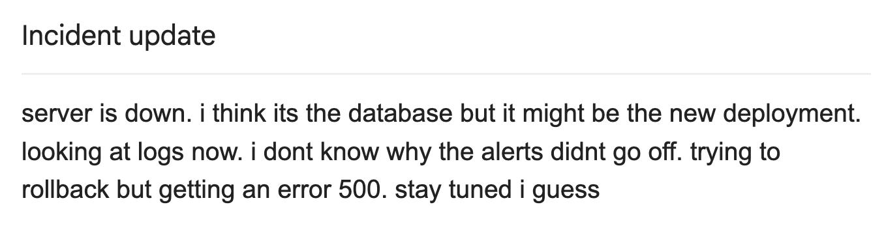
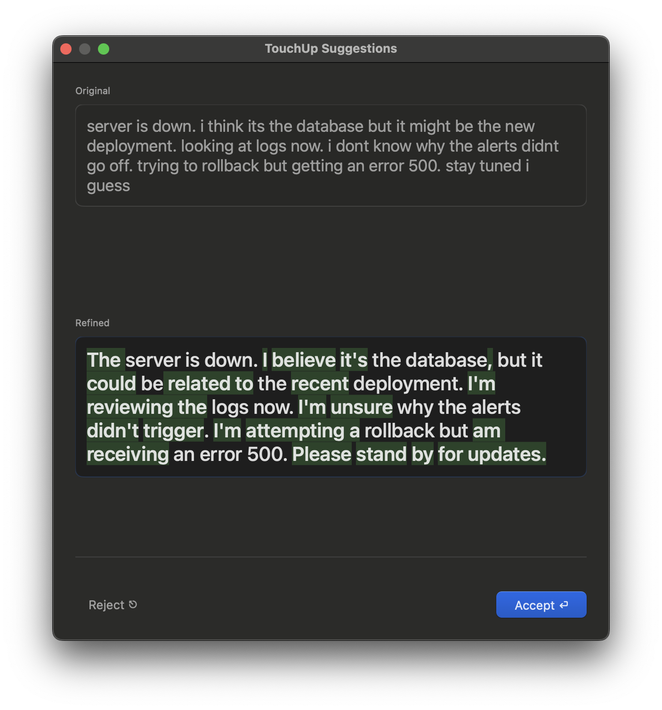
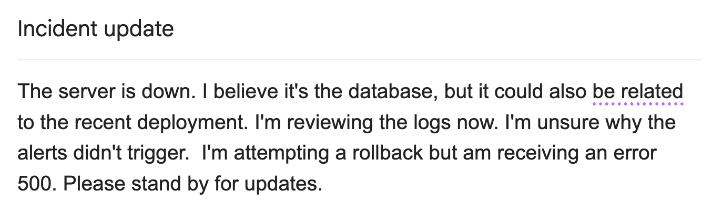

# TouchUp

TouchUp is a macOS menu bar app that instantly polishes your writing using a local LLM, right where you type.

Select any text in any app, press a hotkey, and TouchUp refines your grammar, clarity, and tone in place. No copy-pasting into a chatbot. No cloud. No cost.

> **Note:** This repository is the macOS-only version of TouchUp. Support for other platforms will live in separate, dedicated repositories.

## Why TouchUp?

Most AI writing tools send your text to the cloud. TouchUp takes a different approach:

- **Local only** — Your text never leaves your machine. All inference runs on-device through [Ollama](https://ollama.com/).
- **No API cost** — No API keys, no subscriptions, no token usage fees.
- **Private by design** — No data collection, no telemetry, no network calls.

TouchUp is inspired by the [Ollama](https://ollama.com/) project and its rapidly growing ecosystem. It is part of a broader effort to build a **local LLM ecosystem** — practical, everyday tools powered entirely by models running on your own hardware.

## See It in Action

1. **Draft your text** — Write an email, a quick note to a teammate, or anything else — right where you normally would.
2. **Select & trigger** — With TouchUp running quietly in the menu bar, select your draft and press the hotkey (`⌘ ⌥ T`).
3. **Local LLM takes over** — TouchUp sends the text to a local model running on your machine. It corrects grammar, fixes typos, and improves clarity — all while preserving your original tone. No network required. No paid cloud LLM subscription.
4. **Review & accept** — A suggestion window appears with the refined text. Accept it, and TouchUp automatically replaces the selected text.
5. **Works in any app** — TouchUp uses the system clipboard under the hood, so it works everywhere on your Mac — Apple Notes, Mail, Slack, VS Code, you name it.

| Before | TouchUp Suggestions | After |
|:---:|:---:|:---:|
|  |  |  |

## Features

- **Works everywhere** — Fully compatible with any app that supports standard text selection.
- **Configurable hotkey** — Set your preferred trigger shortcut.
- **Model selection** — Use any Ollama model.
- **Default prompt preserves your tone** — Out of the box, TouchUp fixes grammar, spelling, and typos while keeping your original tone intact. What you said, just polished.
- **Custom prompts** — Swap in your own prompt to go beyond polishing: translate to another language, shift to a more formal or casual tone, summarize long text, reformat into bullet points, and more.
- **Advanced tuning** — Configure context length, keep-alive duration, and dynamic token prediction.

## Requirements

- **macOS** (built with SwiftUI, runs natively)
- **[Ollama](https://ollama.com/)** installed and running locally

## Installation

### 1. Install Ollama (Required)

TouchUp uses Ollama as its LLM backend. This is a **hard dependency** — the app will not function without it.

1. Download and install Ollama from [ollama.com](https://ollama.com/).
2. Pull a model. For best results, use a model with sufficient parameters:

   ```bash
   ollama run gemma2:9b
   ```

   Models like `gemma2:9b` and `llama3.1:8b` offer a good balance of quality and speed. Smaller models (1B–3B) run faster but may produce lower-quality results. Browse available models at [ollama.com/library](https://ollama.com/library).

### 2. Install TouchUp

#### Option A: Download from GitHub Releases (Recommended)

1. Go to the [**Releases**](../../releases) page.
2. Download the latest `.zip` asset (kept in sync with the `main` branch).
3. Unzip and move `TouchUp.app` to your Applications folder.
4. On first launch, **grant Accessibility permissions** when prompted — this is required for TouchUp to read and replace selected text.
5. If macOS blocks the app (unidentified developer), right-click the app and choose **Open**, or run:

   ```bash
   xattr -dr com.apple.quarantine /Applications/TouchUp.app
   ```

#### Option B: Build from Source

1. Clone this repository.
2. Open `TouchUp.xcodeproj` in Xcode.
3. Build and run (`⌘R`).
4. Grant Accessibility permissions when prompted.

## Permissions

TouchUp requires **Accessibility access** to read selected text and replace it with the refined version. macOS will prompt you to grant this on first use. You can manage it anytime in:

**System Settings → Privacy & Security → Accessibility**

## Latency

Tested on **Apple M3 Max** with `gemma2:9b` — input: **284 characters**.

| Scenario | Ollama Latency |
|---|---|
| Cold start (model not loaded) | 2782ms |
| Warm (model already loaded) | 1580ms |

The warm model is **~43% faster** on Ollama inference if the model is pre-warmed.

For even faster response times, try a smaller model like `gemma2:2b` or `llama3.2:3b` — they handle everyday grammar and typo corrections with noticeably lower latency. On the other hand, if you're using a custom prompt for more complex text tasks (rewriting tone, restructuring paragraphs, translating), a larger model will deliver higher-quality results, though with higher latency.

## License

This project is licensed under the [MIT License](LICENSE).
