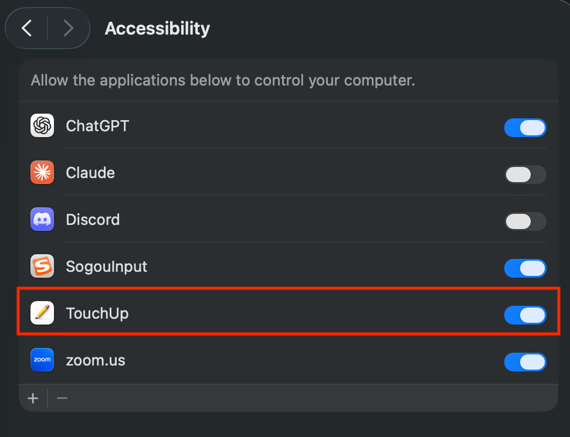
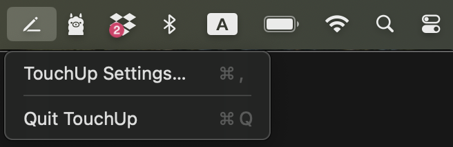

# TouchUp

TouchUp is a macOS menu bar app that instantly polishes your writing using a local LLM, right where you type.

Select any text in any app, press a hotkey, and TouchUp refines your grammar, clarity, and tone in place. No copy-pasting into a chatbot. No cloud. No cost.

> **Note:** This repository is the macOS-only version of TouchUp. Support for other platforms will live in separate, dedicated repositories.

## Why TouchUp?

Most AI writing tools send your text to the cloud. TouchUp takes a different approach:

- **Local only** — Your text never leaves your machine. All inference runs on-device through [Ollama](https://ollama.com/).
- **No API cost** — No API keys, no subscriptions, no token usage fees.
- **Private by design** — No data collection, no telemetry, no network calls.

TouchUp is inspired by the [Ollama](https://ollama.com/) project. It's part of a growing movement to build practical, everyday tools powered entirely by local models running on your own hardware.

## See It in Action

Select any text, press the hotkey, and TouchUp handles the rest — grammar, spelling, clarity — all in place.

| Before | TouchUp Suggestions | After |
|:---:|:---:|:---:|
|  |  |  |

## Features

- **Works everywhere** — Fully compatible with any app that supports standard text selection.
- **Configurable hotkey** — Set your preferred trigger shortcut.
- **Model selection** — Use any Ollama model.
- **Default prompt preserves your tone** — Out of the box, TouchUp fixes grammar, spelling, and typos while keeping your original tone intact. What you said, just polished.
- **Custom prompts** — Swap in your own prompt to go beyond polishing: translate to another language, shift to a more formal or casual tone, summarize long text, reformat into bullet points, and more.
- **Advanced tuning** — Configure context length, keep-alive duration, and dynamic token prediction.

## Requirements

- **macOS** (built with SwiftUI, runs natively)
- **[Ollama](https://ollama.com/)** installed and running locally

## Installation

### 1. Install Ollama (Required)

TouchUp requires Ollama to run — it won't work without it.

1. Download and install Ollama from [ollama.com](https://ollama.com/).
2. Pull a model. For best results, use a model with sufficient parameters:

   ```bash
   ollama pull gemma2:9b
   ```

   Models like `gemma2:9b` and `llama3.1:8b` offer a good balance of quality and speed. Smaller models (1B–3B) run faster but may produce lower-quality results. Browse available models at [ollama.com/library](https://ollama.com/library).

### 2. Install TouchUp

#### Option A: Download from GitHub Releases (Recommended)

1. Go to the [**Releases**](../../releases) page.
2. Download the latest `.zip` asset (kept in sync with the `main` branch).
3. Unzip and move `TouchUp.app` to your Applications folder.
4. **Bypass macOS Gatekeeper** (if blocked). If the app is blocked with the message "Apple could not verify 'TouchUp' is free of malware...", run this command in your terminal:

   ```bash
   xattr -dr com.apple.quarantine /Applications/TouchUp.app
   ```

5. **Grant Accessibility permissions** — Navigate to **System Settings → Privacy & Security → Accessibility** and add TouchUp. This is required for the app to detect your hotkey and replace selected text.

   

#### Option B: Build from Source

1. Clone this repository.
2. Open `TouchUp.xcodeproj` in Xcode.
3. Build and run (`⌘R`).
4. Grant Accessibility permissions — same as step 5 above.


## Usage

TouchUp operates quietly in the background as a menu bar app. It doesn't have a main window—instead, it's always ready whenever you're typing.

1. **Select your text** in any application (Notes, Mail, Slack, Chrome, etc.).
2. **Press the hotkey** (`⌘ ⌥ T` by default) to send the text to your local LLM.
3. **Review the suggested changes** in the popup window.
4. **Accept** to instantly replace your original text, or **Reject** to dismiss the suggestion.

You can click the TouchUp icon in your menu bar at any time to access settings or change your hotkey.



## Settings

You can customize TouchUp to fit your workflow by clicking the menu bar icon and opening **Settings**.

### 1. Ollama Settings
- **Ollama Model**: Select which local model to use for inference. TouchUp automatically detects models installed via Ollama. Click the refresh button if you recently pulled a new model.
- **Ollama Server Address**: Change the address if your Ollama instance is running on a different port or a remote machine (default: `http://127.0.0.1:11434`).

### 2. Hotkey
- Set your preferred keyboard shortcut to trigger TouchUp (default: `⌘ ⌥ T`). Click the button and press your desired combination to change it.

### 3. Prompt Strategy
- **Default Prompt**: Focuses strictly on fixing grammar, clarity, and typos while preserving your original tone.
- **Custom Prompt**: Write your own system prompt to change how TouchUp behaves. You can use this for translation, summarizing, converting to bullet points, or adopting a specific persona.

### 4. Advanced Ollama Settings
- **Keep Alive**: How long the model stays loaded in memory after a request. Increasing this reduces latency for subsequent uses.
- **Context Length**: Maximum number of tokens (prompt + response) allowed per request. Choose between 2048, 4096, or 8192.
- **Dynamic Token Prediction**: Dynamically adjusts the output token limit based on your input to improve execution speed and reduce latency.

## Latency

Since inference runs locally, latency depends on your hardware and model size. Here are rough benchmarks on an **Apple M3 Max (64 GB)** with `gemma2:9b` — input: **284 characters**.

| Scenario | Ollama Latency |
|---|---|
| First request (model loading into memory) | 2782ms |
| Subsequent requests (model already in memory) | 1580ms |

Keeping the model loaded in memory (see **Keep Alive** in Settings) avoids the loading overhead and cuts latency by **~43%**.

For even faster response times, try a smaller model like `gemma2:2b` or `llama3.2:3b` — they handle everyday grammar and typo corrections with noticeably lower latency. For more complex tasks (rewriting tone, translating, restructuring), a larger model will deliver higher-quality results at the cost of higher latency.

## Contributing

Found a bug or have a feature request? [Open an issue](../../issues). Pull requests are welcome.

## License

This project is licensed under the [MIT License](LICENSE).
